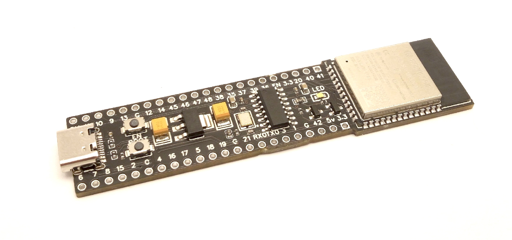
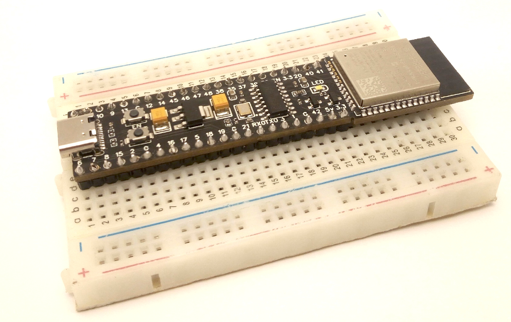
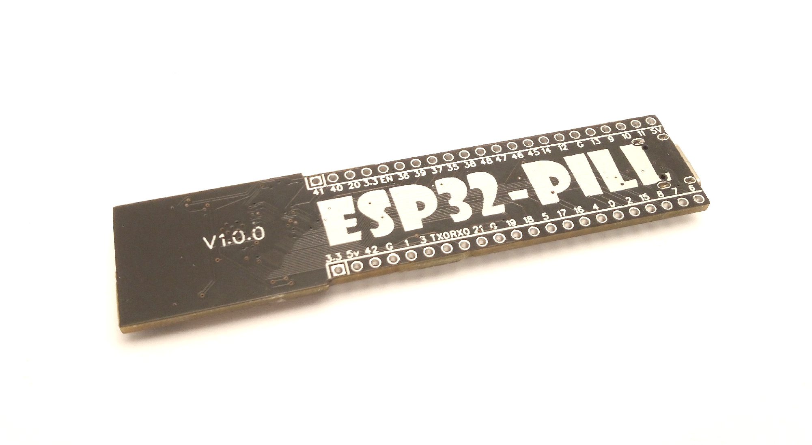
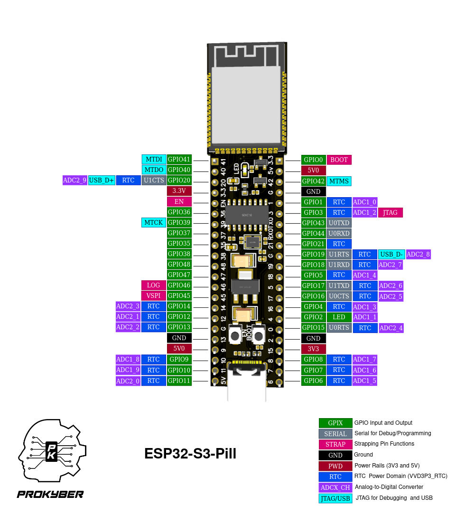
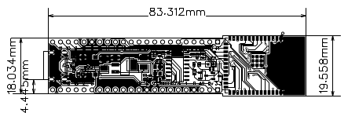
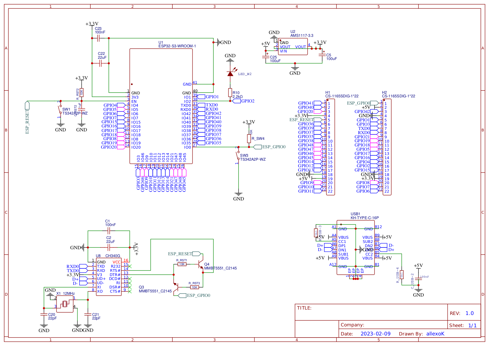

# ESP32-S3-Pill
## Introduction:
ESP32-S3-Pill is a line of low-cost development boards for ESP32S3 that fits the breadboard and leaves more breadboard holes open, than standard Devkit boards.
Programming is performed via USB connector.

## Features:

- ESP32-S3-WROOM-1 module.
- USB-C connector.
- 36 programmable pins are available.
- CH340G USB-UART converter.
- USER-Led(GPIO2).
- Reset button and User button(GPIO0).
- Accepts power through:
  - USB
  - External source (1.8V-5V)

## Pinout and dimensions

## Programming options:
Using vscode Platformio or Arduino IDE

## Uploading example project:
For example projects go to https://github.com/allexoK/ESP32-S3-Pill-examples/

## Schematics

# Esp32-S3-Pill-Board-docs
